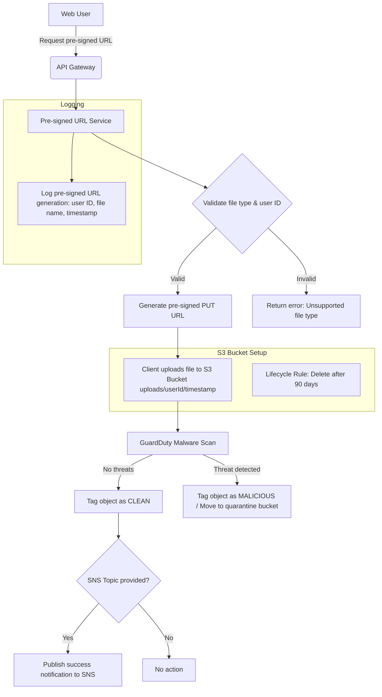
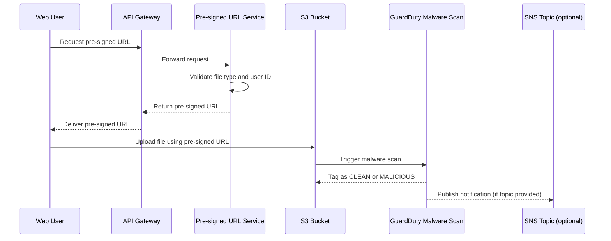

# 📄 File Upload Architecture (Mermaid.js)

## Architecture Description

- Web users request pre-signed URLs through an API Gateway, which forwards the request to a backend Pre-signed URL Service.
- The service validates the file type and user ID before generating the pre-signed URL.
- Upon successful validation, a pre-signed PUT URL is issued to the client.
- Users upload files directly to a designated S3 bucket, following the `uploads/{userId}/{timestamp}` structure.
- Amazon GuardDuty automatically scans new uploads for malware.
- Clean files are tagged as "CLEAN," and optionally a notification is sent to an SNS topic if the caller requested it.
- Malicious files are tagged as "MALICIOUS" and optionally moved to a quarantine bucket.
- Lifecycle rules on the S3 bucket ensure files are automatically deleted after 90 days.
- All pre-signed URL generation events are logged for auditing purposes.

## Architecture Diagram

## Sequence Diagram

